# Genome Firewall - Full System Architecture

## 1. Architectural objective

Genome Firewall is a defensive research prototype that accepts one quality-checked, reconstructed bacterial genome in FASTA format for one supported species and produces one result per supported antibiotic:

- `LIKELY_TO_FAIL`
- `LIKELY_TO_WORK`
- `NO_CALL`

Every result includes calibrated confidence, evidence, model and database versions, and a mandatory warning that standard laboratory testing must confirm the result.

The system begins after isolation, sequencing, assembly, quality control, and species identification. It does not process raw reads, identify species, reconstruct genomes, or design/modify organisms.

## 2. Logical architecture

```mermaid
flowchart LR
    subgraph O[Offline training and validation]
        D["Pinned BV-BRC dataset\nFASTA + lab AST labels"] --> V["Dataset validation\nprovenance, checksums, QC"]
        V --> C["Homology clustering\nand grouped split"]
        C --> A1["AMRFinderPlus\nannotation"]
        A1 --> F1["Versioned feature builder"]
        K["Drug knowledge base\ntargets, names, label rules"] --> F1
        F1 --> T["Per-antibiotic training\nregularized logistic regression"]
        T --> CAL["Probability calibration\nand no-call thresholds"]
        CAL --> E["Held-out evaluation\nmetrics, reliability, coverage"]
        E --> R["Model registry\napproved bundles"]
    end

    subgraph I[Online inference]
        U["Streamlit/Gradio app\nor API client"] --> G["Upload gateway"]
        G --> Q["FASTA validation + QC\nspecies/scope check"]
        Q --> A2["Sandboxed AMRFinderPlus job"]
        A2 --> F2["Feature builder\nsame schema as training"]
        F2 --> OOD["Out-of-distribution and\nfeature compatibility checks"]
        R --> P["Per-antibiotic inference"]
        F2 --> P
        K --> TG["Deterministic molecular-target gate"]
        F2 --> TG
        OOD --> DP["Decision policy"]
        P --> DP
        TG --> DP
        DP --> X["Evidence and explanation composer"]
        X --> REP["Decision report\nfail / work / no-call"]
        REP --> U
        REP --> AU["Immutable audit record"]
    end
```



## 3. Offline training and evaluation plane

### 3.1 Dataset registry

Use the organizer-pinned dataset for one species, ideally 1,000-3,000 genomes and 3-5 predefined antibiotics. Store:

- assembled FASTA file and SHA-256 checksum;
- accession, source, license, collection metadata, and genome quality flags;
- laboratory-measured antimicrobial susceptibility testing (AST) result;
- standardized antibiotic identifier and original measurement/unit;
- one reproducibly derived label per genome-antibiotic pair;
- exclusion reason when a row is unusable.

Do not use general phenotype fields that may contain model-generated predictions.

### 3.2 Data validation

Validate manifest-to-file integrity, FASTA syntax, nucleotide alphabet, contig count, genome length, ambiguous-base rate, duplicated accessions, label validity, units, missingness, and supported-species identity supplied by the dataset. Quarantine failures rather than silently repairing them.

### 3.3 Leakage prevention and split service

Cluster genomes by sequence homology before any model fitting. Assign whole clusters, never individual rows, to:

1. training;
2. confidence-calibration/validation;
3. held-out or hidden test.

Persist the clustering method, threshold, software version, cluster ID, random seed, and split manifest. Tune and justify the threshold using the fixed challenge protocol. This prevents identical or near-identical genomes from appearing across train and test.

### 3.4 Genome annotation and feature extraction

Run AMRFinderPlus as the default, pinned annotation engine. Produce a normalized, versioned feature table containing:

- resistance gene presence/absence;
- resistance-associated mutation presence/absence;
- gene family, allele, identity, coverage, contig, and coordinates;
- molecular-target presence/absence/unknown for each drug;
- selected genome-QC indicators;
- optional sparse k-mer or learned-region features in a separate experimental feature set.

The feature builder must be identical in training and inference. Unknown features are logged and ignored according to the frozen schema; missing expected features are represented explicitly, not inferred as biological absence when annotation/QC is inadequate.

### 3.5 Drug knowledge base

Maintain a curated, versioned table with:

- canonical drug ID and aliases;
- supported species;
- molecular target(s) and target-detection rule;
- phenotype-label derivation rule;
- eligible model bundle;
- evidence mappings for known resistance genes/mutations;
- contraindicated or unsupported combinations;
- provenance and review date.

This knowledge base drives both label standardization and the deterministic target gate.

### 3.6 Modeling

Train one regularized logistic-regression model per antibiotic as the dependable baseline. Each model uses only training clusters and returns probability of phenotypic resistance. Handle imbalance with class weights or training-only resampling, selected on grouped validation data.

Optional models (k-mer, gradient boosting, regional genomic embeddings, protein embeddings) should be benchmarked against the baseline and must use the same splits. They are promoted only if they improve held-out performance and calibration without weakening interpretability or coverage.

### 3.7 Calibration and abstention

Fit Platt, isotonic, or another justified calibrator using only the calibration split. Select two thresholds per drug:

- probability at or above `T_fail` -> candidate `LIKELY_TO_FAIL`;
- probability at or below `T_work` -> candidate `LIKELY_TO_WORK`;
- probability between thresholds -> `NO_CALL`.

Thresholds should reflect the asymmetric risk of missing resistance, not maximize raw accuracy. A prediction is also forced to `NO_CALL` for poor input quality, unknown target status, unsupported scope, schema mismatch, out-of-distribution input, weak evidence, or conflicting evidence.

### 3.8 Evaluation and promotion gate

Report per antibiotic and by genetic cluster/group:

- balanced accuracy;
- resistant recall and susceptible recall separately;
- F1, AUROC, and PR-AUC;
- Brier score and reliability plot;
- no-call rate (coverage) and accuracy on called cases;
- confusion matrix and confidence intervals where feasible;
- performance on previously unseen genetic groups.

A model bundle is promoted only with its model card, supported scope, exclusions, metrics, calibration plot, feature schema, AMRFinderPlus/database version, drug-KB version, code version, dataset version, and reproducible build record.

## 4. Online inference plane

### 4.1 Upload gateway

Accept `.fasta`, `.fa`, or `.fna` files with strict size/time limits. Compute a checksum, create a request ID, scan the filename/content type, and store the upload only for the configured retention period. Never accept raw reads or mixed-sample inputs.

### 4.2 Input validation and QC

Confirm FASTA syntax, assembled-genome plausibility, dataset-declared species match, genome length range, contig count, ambiguous-base rate, and supported scope. A failure returns an explicit rejection or no-call reason; it never flows into the model as a normal negative feature.

### 4.3 Annotation worker

Run AMRFinderPlus in a locked-down container with pinned executable and database versions, no outbound network, CPU/memory/time limits, read-only reference data, and a temporary per-job workspace. Convert its output to the frozen feature contract.

### 4.4 Compatibility and novelty checks

Before prediction, verify feature-schema compatibility and estimate whether the genome is unlike the training distribution. Signals may include distance to the nearest training cluster, excessive unseen features, missing expected annotations, and QC anomalies. Exceeding an approved threshold forces no-call.

### 4.5 Deterministic target gate

For every drug:

- target confidently present -> allow model evaluation;
- target confidently absent in a sufficiently complete genome -> block `LIKELY_TO_WORK` and return a curated target-incompatibility result, normally `LIKELY_TO_FAIL`;
- target status unknown or absence may be caused by poor assembly/annotation -> `NO_CALL`.

This gate prevents the absence of known resistance markers from being treated as proof that a drug will work.

### 4.6 Prediction and decision engine

Load the approved model bundle for the species and drug, score the feature vector, calibrate the resistance probability, and apply the following precedence:

1. unsupported species/drug, failed QC, schema/version mismatch, or job failure -> `NO_CALL`;
2. unknown target or out-of-distribution genome -> `NO_CALL`;
3. confidently absent required target -> curated target-incompatibility decision;
4. conflicting known evidence or probability inside the abstention interval -> `NO_CALL`;
5. calibrated probability >= `T_fail` -> `LIKELY_TO_FAIL`;
6. calibrated probability <= `T_work`, target present, and all safety checks pass -> `LIKELY_TO_WORK`;
7. otherwise -> `NO_CALL`.

### 4.7 Evidence composer

Create explanations from structured data, with a strict evidence hierarchy:

1. `KNOWN_MECHANISM`: curated resistance gene, mutation, or target incompatibility was detected;
2. `STATISTICAL_ASSOCIATION`: the model score is driven by associated features without claiming causality;
3. `NO_KNOWN_RESISTANCE_SIGNAL`: no curated marker was found, explicitly stating that absence of evidence is not evidence of susceptibility.

SHAP or feature importance may describe model influence but must never be presented as proof of a biological cause.

An optional language model may rewrite the already-final structured result into plain language. It must not receive authority to change the class, confidence, evidence, or safety warning, and the system must work without it.

### 4.8 Report and user interface

Display a summary table with one row per drug:

- drug;
- result;
- calibrated confidence;
- evidence category;
- supporting genes/mutations or target status;
- no-call/rejection reason;
- supported species and model version.

Allow expansion into technical evidence and a downloadable JSON/PDF report. Keep `Confirm with standard laboratory testing` permanently visible. Label the system as research decision support, not a treatment recommendation.

## 5. Core contracts

### 5.1 Feature record

```json
{
  "sample_id": "request-scoped-pseudonym",
  "species": "supported_species",
  "genome_sha256": "...",
  "qc": {"status": "PASS", "contigs": 73, "ambiguous_fraction": 0.001},
  "annotation": {"tool": "AMRFinderPlus", "tool_version": "pinned", "db_version": "pinned"},
  "genes": ["gene_family_or_allele"],
  "mutations": ["normalized_mutation"],
  "drug_targets": {"drug_id": "PRESENT"},
  "feature_schema_version": "1.0.0"
}
```

### 5.2 Prediction record

```json
{
  "request_id": "uuid",
  "species": "supported_species",
  "drug_id": "canonical_drug_id",
  "decision": "LIKELY_TO_FAIL | LIKELY_TO_WORK | NO_CALL",
  "confidence": 0.91,
  "resistance_probability": 0.91,
  "evidence_category": "KNOWN_MECHANISM | STATISTICAL_ASSOCIATION | NO_KNOWN_RESISTANCE_SIGNAL",
  "evidence": [{"type": "gene", "name": "normalized_identifier", "provenance": "curated_db"}],
  "target_status": "PRESENT | ABSENT | UNKNOWN",
  "no_call_reasons": [],
  "model_version": "...",
  "drug_kb_version": "...",
  "warning": "Research prototype. Confirm with standard laboratory testing."
}
```

## 6. Deployable service layout

For a hackathon, deploy a modular monolith plus one worker:

- Streamlit or Gradio UI;
- FastAPI orchestration/report API;
- background annotation worker;
- PostgreSQL for job metadata, model metadata, drug KB, and audit events;
- S3-compatible object storage for temporary FASTA inputs and reports;
- read-only model/artifact store;
- containerized AMRFinderPlus runtime.

For later scale, separate upload, annotation, inference, report, and registry services behind a queue. Horizontal scaling is most useful for annotation workers; model inference is inexpensive on CPU.

Suggested endpoints:

- `POST /v1/jobs` - submit one supported assembled genome;
- `GET /v1/jobs/{id}` - status and validation result;
- `GET /v1/jobs/{id}/report` - final structured report;
- `GET /v1/models/scope` - supported species, drugs, and versions;
- `GET /health` and `GET /ready` - operational checks.

## 7. Security, privacy, and biosecurity controls

- Enforce defensive-only functionality; expose no sequence design, mutation suggestion, synthesis, or optimization capability.
- Use least-privilege service identities, encryption in transit/at rest, short retention, access logs, rate limits, and signed artifact provenance.
- Isolate the annotation tool and disable outbound network access during jobs.
- Do not log raw FASTA content. Use request IDs and checksums in operational logs.
- Keep prediction records reproducible through exact model, database, code, and schema versions.
- Require human review and lab confirmation; never connect predictions directly to prescribing or automated treatment systems.
- Make unsupported scope and no-call visible, downloadable, and auditable.

## 8. Observability and audit

Track job latency, validation failure rate, annotation failure rate, no-call rate by reason and drug, target-gate outcomes, model score distributions, feature drift, unseen-feature rate, calibration drift once verified outcomes exist, and model/version usage. Alert on sudden changes, but do not silently change thresholds or models.

Each report should be reproducible from an audit bundle containing input checksum, QC result, normalized annotations, feature schema, model and calibrator versions, thresholds, target-gate result, evidence sources, decision trace, timestamp, and software/database versions.

## 9. Recommended repository structure

```text
genome-firewall/
  app/                 # Streamlit/Gradio interface
  api/                 # job and report API
  workers/             # isolated AMRFinderPlus execution
  genome_reader/       # validation, QC, annotation parser, features
  predictor/           # model loading, calibration, OOD, target gate
  reporting/           # evidence composer and report schemas
  training/            # manifests, clustering, splits, fitting, evaluation
  knowledge/           # versioned drug/target/evidence definitions
  schemas/             # JSON schemas and feature contracts
  tests/               # unit, contract, integration, safety, regression tests
  model_cards/         # scope and performance documentation
  infra/               # containers and deployment configuration
```

## 10. Build sequence

1. Freeze one species, 3-5 drugs, label rules, and grouped train/calibration/test manifests.
2. Implement FASTA validation, AMRFinderPlus execution, normalized feature schema, and reproducibility tests.
3. Build the drug/target knowledge base and deterministic target gate.
4. Train per-drug logistic baselines, calibrate them, and choose abstention thresholds.
5. Evaluate on held-out genetic groups and publish model cards.
6. Build the API/UI, evidence report, mandatory lab warning, downloadable audit record, and defensive-scope controls.
7. Add optional advanced models or language-model explanations only after the baseline passes leakage, calibration, and safety checks.

